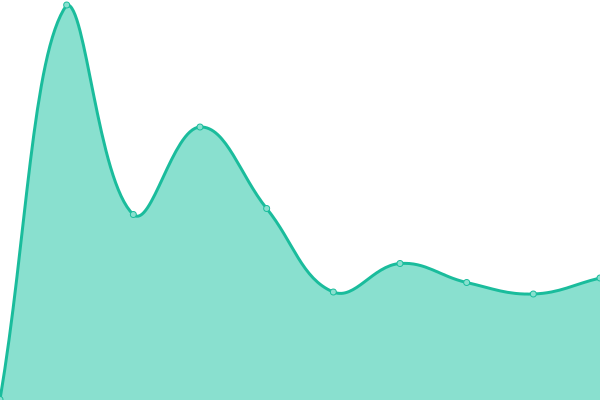
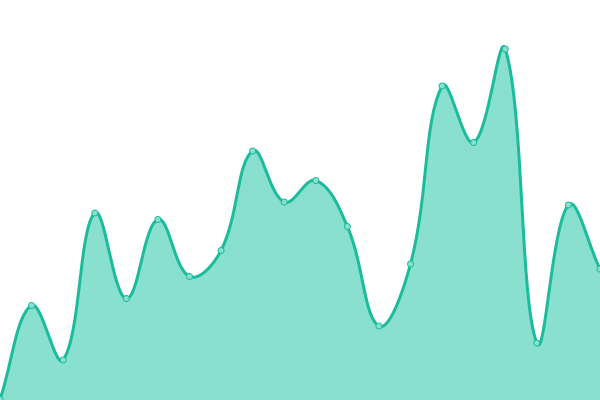

# [📈 Live Status](https://SOPORTEAYIGROUP.github.io/STATUSVEDI): <!--live status--> **🟩 All systems operational**

This repository contains the open-source uptime monitor and status page for [SOPORTEAYIGROUP](https://SOPORTEAYIGROUP.github.io/STATUSVEDI), powered by [Upptime](https://github.com/upptime/upptime).

With [Upptime](https://upptime.js.org), you can get your own unlimited and free uptime monitor and status page, powered entirely by a GitHub repository. We use [Issues](https://github.com/SOPORTEAYIGROUP/STATUSVEDI/issues) as incident reports, [Actions](https://github.com/SOPORTEAYIGROUP/STATUSVEDI/actions) as uptime monitors, and [Pages](https://SOPORTEAYIGROUP.github.io/STATUSVEDI) for the status page.

<!--start: status pages-->
<!-- This summary is generated by Upptime (https://github.com/upptime/upptime) -->
<!-- Do not edit this manually, your changes will be overwritten -->
<!-- prettier-ignore -->
| URL | Status | History | Response Time | Uptime |
| --- | ------ | ------- | ------------- | ------ |
|  [VEDI PROD](https://vedi.cordoba.gob.ar/) | 🟩 Up | [vedi-prod.yml](https://github.com/SOPORTEAYIGROUP/STATUSVEDI/commits/HEAD/history/vedi-prod.yml) | 

 300ms
     
 | 

<a href="https://SOPORTEAYIGROUP.github.io/STATUSVEDI/history/vedi-prod">100.00%</a>
    

|  [VEDI STAGE](https://vedi.stage.cordoba.gob.ar/) | 🟩 Up | [vedi-stage.yml](https://github.com/SOPORTEAYIGROUP/STATUSVEDI/commits/HEAD/history/vedi-stage.yml) | 

 341ms
     
 | 

<a href="https://SOPORTEAYIGROUP.github.io/STATUSVEDI/history/vedi-stage">100.00%</a>
    

|  [VEDI TEST](https://vedi.test.cordoba.gob.ar/) | 🟩 Up | [vedi-test.yml](https://github.com/SOPORTEAYIGROUP/STATUSVEDI/commits/HEAD/history/vedi-test.yml) | 

 301ms
     
 | 

<a href="https://SOPORTEAYIGROUP.github.io/STATUSVEDI/history/vedi-test">100.00%</a>
    

|  [VEDI DEV](https://vedi.dev.cordoba.gob.ar/) | 🟩 Up | [vedi-dev.yml](https://github.com/SOPORTEAYIGROUP/STATUSVEDI/commits/HEAD/history/vedi-dev.yml) | 

 235ms
     
 | 

<a href="https://SOPORTEAYIGROUP.github.io/STATUSVEDI/history/vedi-dev">100.00%</a>
    

|  [GOOGLE](https://www.google.com.ar/) | 🟩 Up | [google.yml](https://github.com/SOPORTEAYIGROUP/STATUSVEDI/commits/HEAD/history/google.yml) | 

 152ms
     
 | 

<a href="https://SOPORTEAYIGROUP.github.io/STATUSVEDI/history/google">100.00%</a>
    

<!--end: status pages-->

[**Visit our status website →**](https://SOPORTEAYIGROUP.github.io/STATUSVEDI)

## 📄 License

- Powered by: [Upptime](https://github.com/upptime/upptime)
- Code: [MIT](./LICENSE) © [SOPORTEAYIGROUP](https://SOPORTEAYIGROUP.github.io/STATUSVEDI)
- Data in the `./history` directory: [Open Database License](https://opendatacommons.org/licenses/odbl/1-0/)
